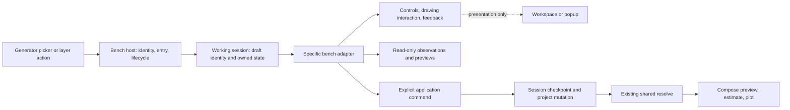

# Compose and open benches — proposal for review

Started 7 September; verification completed 8 September 2026. **Design study, not an accepted architecture or application change.**

[Open the interactive mockups](index.html). The study covers Compose, Second
Reading and Homeostat at desktop, 900 × 650 and 700 × 650 window sizes, with
workspace and popup presentations. Controls rehearse a few sequences against
stored generator output. No application server or hardware is involved.

## Recommendation and decisions

**D1 accepted, 8 September:** Ian chose “default to popup, can expand.”
Benches open as popups, with Expand/Restore changing presentation while preserving
the working session. The embedded alternative remains in the study for reference.
This settles presentation, not approval to implement the entire proposal.

A bench should be an identifiable working environment with its own interaction
model. Its presentation and optional time axis should be independent choices.
Keep the vanilla module architecture, introduce a small lifecycle/adapter seam,
and make all project effects explicit application operations.

| # | Decision for Ian | Recommended direction | Cost or alternative |
|---|---|---|---|
| D1 · accepted | Where sustained bench work lives | B: popup by default, with Expand/Restore | Preserve working state across expansion. No new top-level tab; embedded workspace remains a study alternative. |
| D2 | Compose's editing hierarchy | Selected layer first, folded New material below; persistent expandable layers | Moves familiar Generate controls. Preserve the existing live-edit latch in the selected-layer area; do not silently change its write semantics. |
| D3 | Bench identity | Explicit bench descriptor, independent of time; a compatibility adapter preserves today's axis-based access | Slightly more metadata, but no special treatment of Second Reading in the shared host. |
| D4 | Working-state lifetime in the first migration | Preserve same-page close/reopen; say “memory only”; keep durable recovery a separately approved increment | Reload still loses unkept work. Recovery needs a storage/version/cleanup decision, not optimistic labels. |

These decisions can be accepted independently. D1 is settled; D2–D4 remain
proposals. The existing brief authorizes design work, and the later D1 decision
selects popup presentation. Application implementation remains a separate step.

## What the study carries forward

The [holistic review](../../reviews/ui-review-2026-09-07/REVIEW.md) is the source,
not a competing brief. The [later agreement](../../plans/ui-benches-next-session.md)
settles which direction to explore. The [cosmetics pass](../../reviews/ui-review-2026-09-07/cosmetics/README.md)
already repaired stage fit and refreshed controls; those findings are not being
presented as unfixed cosmetic work.

1. **F09/F15 — editing scope and layer access.** A clear selected-layer heading
   precedes its controls. The layer list remains a separate, persistent region.
   Expanding the stack borrows inspector height, never the whole paper area.
2. **F11/F12/F13 — sustained development and alternatives.** Keep the four
   Second Reading actions beside the stage. Compare optionally, using a shared
   source frame. “Alternative” and “Response mode” distinguish branch from policy.
3. **F04/F05/A02 — failure and lifecycle.** A local failure state preserves the
   last image, identifies it as stale, and disables promotion until the exact
   recipe is current. Focus and request cancellation belong to the host seam.
4. **F02/A01 — honest lifetimes.** Working, kept in project and saved to disk
   remain distinct. The mockup does not invent a functioning recovery store or
   a trustworthy Saved badge for the existing application.
5. **A05 — specific environments within a common family.** Share lifecycle and
   application access; keep event capture and branch semantics out of the generic
   time-axis adapter. Renderer replacement, node editing, output reorganisation,
   generator policy changes and universal scoring are outside this pass.

Palette values are imported from the existing raw Flexoki CSS and use its
[published dark semantic mapping](https://stephango.com/flexoki): black/950
backgrounds, 900/850 interface surfaces, 200 body text and 400-level accents.
Informational secondary text uses the brighter existing 400 neutral tier.
Roboto Mono is loaded from the repository's offline fonts.

## Layout and flow

### C1 — Compose

Desktop: paper area plus a 330px inspector, versus the 540px inspector documented
in the review. At 900px the proposed inspector is 290px; at 700px it is 260px.
Those are trial dimensions, not measured ergonomic optima. The layer dock starts
at roughly 150–160px and can expand upward. Inspector content scrolls independently.
Placement remains available at compact sizes, accepting a smaller paper view to
retain precise editing access.

The example selects a kept Second Reading layer. **Resume in bench** creates or
opens working material derived from it; it is not an edit-in-place operation.
For ordinary editable sources, this same selected-layer scope should house the
current latch controls and continuous-edit coalescing. The mocked New material
section shows the existing picker with a **Benches** group. Its shown entries are
examples, not a membership list to hard-code; frame-fallback sources must also
remain discoverable through the migration rule below.

No new layer grouping, tree model, output tab rename or generator browser is
required. Empty selection should show New material first and a neutral “No layer
selected” state. Multiple selection should replace single-layer controls with the
existing applicable bulk operations, retaining the stack; these two states are
specified here but not individually mocked.

### B1 — Common bench shell

A title and origin (“From Reading 1” or “New material”), drawing region, local
status, and explicit return are common. On desktop a 300px control column scrolls
without stealing stage height. At 1050px and below, controls become a bounded
lower shelf opened with **Controls**. This allocates more initial area to the
drawing than Compose's compact policy. On very short windows or with enlarged
text, allow a documented minimum stage and scrolling rather than clipping ink or
concealing actions.

Returning pauses playback, ends or cancels an active gesture deliberately and
restores composition selection/view and the invoking control. It retains working
state. A small Return to bench affordance appears in Compose after a visit; this
is a return link within Compose, not a new navigation tab. A popup's Expand changes
layout only. A workspace's bench contents should occupy the same region without
reconstructing the draft.

For modal presentation, make composition inert and contain focus in the bench;
restore it on return. For embedded presentation, activate only the current
workspace's tools. Escape cancels an active capture before returning. Global
hardware Stop must remain available if a job is already running; it is not a
bench project command. The mockup depicts a disconnected machine, not the complete
active-job state. No direct Plot action is introduced for an unkept draft.

### B2 — Second Reading

Open from the picker or resume a kept recipe. Read the current alternative and
turn above the paper. **Your turn** arms capture in the fixed recipe frame;
**Continue one turn** applies pending next-turn settings; **Try another** retains
the previous alternative and branches; **Keep as layer** creates a new layer from
the exact rendered recipe. Keep does not end the bench or save the project to disk.

Next turn, Your pen, Alternatives, New drawing and Process details have separate
folds. Boundary, dimensions and seed belong to New drawing, not the current turn.
Show active → queued values only when different, and offer discard-pending in the
implementation. The mock controls only demonstrate the pending label; they do
not implement the event editor. Scrubbing backward preserves later material;
editing there uses the current fork-prefix policy. Bench undo/redo remains local.

The optional two-up view uses the same 280 × 198 frame for both fixtures, with
explicit independent turn labels. This does not equate the works' quality. Future
overshoot comparison needs an explicit choice of recipe-workspace or final placed
frame; these fixtures compare final source documents after whole-element fit.
Do not independently fit ink bounds and call that shared scale.

### B3 — Homeostat

Open a new-layer bench. Viability controls are initially open; hand/coupling and
frame/seed are collapsed. Playback is explicitly **steps**. Non-axis changes
regenerate the trajectory from the seed; they do not become next-step interventions.
**Create layer at step N** preserves the current new-layer behaviour. A committed
layer's **Watch** remains read-only and has no Create/Keep or editable source form.

The proposed telemetry fold could show a named essential variable, its viable
band, reroll markers and per-unit traces. It belongs to the Homeostat adapter and
is observational, not an objective or a beauty score. Today's generic popup graphs
point count from visited previews. Rich telemetry is therefore a proposed UI
increment even though the generator already emits numeric telemetry. The mock's
trace is explicitly illustrative; the drawing and adjacent JSON recipe are real
fixture output. Do not pass that trace off as a measured run.

## Architecture: the smallest useful contract

### A1 — Identity and registration

Current source descriptors export effective `time_axis` and `bench_capabilities`
from [registry.py](../../../axibridge/registry.py#L338). `moduleAxis()` trusts that
server answer; it must continue doing so. Effective axis is a valid declared axis,
otherwise a `frame` parameter, otherwise none. It is not synonymous with
`ProcessModule`. Second Reading is dispatched by the conjunction of intervention
and branch flags, not by a universal event protocol.

**Proposed:** add an optional versioned `bench` descriptor to a source, with stable
adapter ID and supported entry modes. For example, a `second-reading` adapter owns
the known event format; a `process` adapter offers schema controls and bounded
axis playback. Homeostat can initially use `process`, then register its own adapter
composed from those controls when its telemetry needs justify it. Names here are
provisional, not API commitments.

A small frontend map resolves adapter IDs to local ES-module factories. Unknown or
unsupported declared adapters produce a named unavailable state, not a misleading
generic intervention form. Only validated installed adapters expose controls.
Capability strings describe supported interactions; they never substitute for a
versioned protocol or grant arbitrary application access.

Compatibility resolution order:

1. A supported explicit bench descriptor chooses its adapter and entry modes.
2. During migration, the existing intervention+branch signature maps to the known
   Second Reading adapter and validates its event schema/version.
3. Otherwise the server-reported effective axis supplies today's generic bench and
   read-only Watch. Preserve the `frame` fallback and bounds checks.
4. A non-temporal source can explicitly declare a bench without fabricating a time
   parameter. Sources with neither an adapter nor an effective axis remain ordinary
   generators. Unavailable modules keep their existing reason.

The picker groups sources by resolved bench availability, not by a hard-coded set
of IDs. Sources appear once; secondary image/asset characteristics may be described
without duplicating them. The current image grouping needs an explicit precedence
rule: resolved bench eligibility wins the group, preserving the image label.

### A2 — Host, working session and view



The working session outlives its mounted view. Key it by project instance, source,
entry purpose and draft identity; retain origin layer as provenance. Do not key
only by layer ID across project loads, nor use a file path as project identity.
A new-project/load boundary invalidates old application observations even when
layer IDs happen to match.

A practical initial factory returns:

```js
// Proposed shape, deliberately not implementation-ready API syntax.
createBench({ entry, draft, services }) => ({
  mount(root),            // adapter owns its subtree and input semantics
  suspend(reason),        // stop play, release gestures, invalidate preview intent
  resume(),               // same working state, fresh application observations
  snapshot(),             // versioned serialisable working payload; no DOM/timers
  dispose(),              // unsubscribe and release resources; not silent discard
})
```

The host owns title, origin, return target, presentation/focus, and session routing.
The adapter owns controls, branch/event semantics, stage interaction and meaningful
feedback. The stage's coordinate mapping belongs with its drawing interaction,
using a shared fit helper if useful; host chrome must not transform captured points.
A `snapshot()` hook makes persistence possible but makes no durability promise.

Resize, collapse, expand and presentation switches preserve the same session.
Suspend cancels timers, releases pointer capture and invalidates outstanding
preview installs. A late result must match session ID, intent generation and recipe
key before painting; aborting a request alone is insufficient. A pending project
command has a separate lifecycle and must be reconciled, not forgotten on close.

### A3 — Application exchange

Services are narrow, named operations backed by existing application authority.
Start with reading entry context, previewing a recipe and creating a layer. The
adapter does not import the mutable global application state or call arbitrary
endpoints as its extensibility mechanism.

Separate read-only subscriptions from explicit commands:

| # | Scenario | Observation/input | Deliberate command and protection |
|---|---|---|---|
| E1 | Keep a Second Reading alternative | Current draft and successful preview recipe identity | Create a new generator layer with the frozen recipe. One existing Session checkpoint. Return created layer identity; keep the draft. |
| E2 | Watch Homeostat while selecting another layer | Observe the original layer's current source by ID; local scrub overlay | None. Selection does not retarget the watcher. Source removal closes with an explanation; source changes invalidate its preview. |
| E3 | Future bench reads selected composition marks | Explicit “Use selected marks” takes an immutable resolved snapshot with layer IDs, revision and coordinate frame | Copy those marks into bench-local input only when requested. Live selection observations never rewrite a recipe. Exporting edited marks later is a separate command. |
| E4 | Future bench replaces a layer it was opened from | Origin plus expected project/layer revision | Explicit “Replace layer…” shows the named target; compare revision under the mutation lock. Conflict offers new layer or re-read, not overwrite. This command is not in the first pass. |
| E5 | Future bench follows the master timeline | Subscribe to master-t as a view observation; declare mapping to its axis | Following must not PATCH the project or change stored geometry. “Create tween” would be a separate transaction, not a side effect of scrubbing. |

Read-only Watch receives no write service. Commands identify the active project
instance and intended target. Multi-layer commands generate/validate all output
before one atomic checkpoint, using the existing Session pattern. No generator
side effects are introduced. Preview remains generator preview; committed content
enters the existing resolve path for composition, estimates and plotting. Private
bench previews must never bypass that path to reach hardware.

The initial adapter boundary can wrap existing callbacks. Broader revision guards
need server work before enabling E3–E5 across asynchronous project changes. Do not
pretend a frontend token prevents a concurrent server mutation. A reusable mutation
ID/reconciliation mechanism becomes necessary for uncertain write responses: if a
Keep response is lost, determine whether that operation created a layer before
retrying, rather than producing duplicates. Failures before mutation retain the
draft unchanged; cancellation after mutation cannot undo by assumption. Offer the
normal project Undo once the outcome is known.

### A4 — State, undo and durability

| # | State | Owner | Close/reopen | Save/reload contract |
|---|---|---|---|---|
| S1 | Fold state, zoom, active input gesture | Presentation/view; host remembers optional display preferences | Restore folds/zoom; cancel gestures; pause play | Not recipe or project history |
| S2 | Homeostat parameters and visible step | Initially a compatibility bridge to Compose's shared Generate params | Preserve existing same-page values; avoid a second competing parameter object | Not independently saved unless promoted; no new local undo promised |
| S3 | Second Reading alternatives, pending settings, current turn, local history | Its working draft session | Preserve same-page memory draft, with local undo/redo | Only a kept recipe survives through saved project content today; unkept alternatives do not |
| S4 | Kept layer, source recipe/events, affine/effects/pen | Server Project via Session | Exists independently of bench view | Explicit project save persists content and source geometry |
| S5 | Playback timers, request IDs, rendered-preview validity | Runtime only | Stop/invalidate and recompute on return | Never serialise as proof that a preview is current |

The generic bridge is a migration constraint, not the final ideal ownership:
a later reviewed change may make all bench drafts independently owned and explicitly
copy their starting parameters. Until then, returning a bench must continue updating
the Generate form as the current code does. Otherwise a visual refactor changes
what the next Generate action uses.

Second Reading keeps its local history; the host routes Undo to the active owner
and visibly names the scope. Project Undo reverses Keep/Create, never the preceding
human exchange. Undoing a kept layer cannot erase the alternative that produced it.
Redo reinstates project content. A branch records the exact recipe and event
sequence; UI thumbnails are disposable derivatives, never the source of truth.

Preserving a session is different from disposing a view or discarding a draft.
Returning merely suspends. Explicit discard removes working material after an
accurate loss prompt. New/load/restart must address dirty drafts and unsaved project
work together; cancel leaves both intact. If recovery is added later, recommend an
atomic versioned recovery slot plus explicit attachment of selected drafts to a
project. It must define migrations, missing assets, limits and pruning before the
UI says “Recovered.” This proposal does not add recovery to the project format.

### A5 — Compatibility check

1. **Second Reading:** event-aware adapter, fixed capture frame, private branches,
   exact-render Keep gate and local undo. Resume makes new work; it does not replace
   the original layer. Same-page memory lifetime is preserved first.
2. **Homeostat:** bounded steps, pure seeded generation, optional domain telemetry;
   generic create and read-only Watch retained. Its stitched document semantics
   remain in the source module, not the shell.
3. **Venation:** generic process adapter, including convergence before the requested
   step. No forced event editor or branching controls.
4. **Grammar:** declared-axis generic adapter even though it is not necessarily a
   `ProcessModule`. Playback comes from descriptor bounds, not inheritance checks.
5. **Frame-fallback image/sequence sources:** existing effective axis still grants
   generic access; these may regenerate differently and lack process telemetry.
6. **Hypothetical non-temporal spatial bench:** declares an adapter and no axis;
   supplies its own selection/drag controls and explicit Create operation. Joining
   changes registry/adapter files, not the host's decision tree. This is the design
   test for openness; implementing the hypothetical bench is out of scope.

## Bounded implementation sequence, after review

1. **P1 — refine the selected popup.** Popup by default with expansion is accepted.
   Confirm selected-layer-first ordering, action placement and compact control
   shelf. Revise the study before touching app layout.
2. **P2 — extract lifecycle without changing presentation.** Wrap current entry
   callbacks, memory drafts and view ownership. Add close/return, gesture/focus and
   latest-preview guards. Keep existing picker eligibility and creation semantics.
   Exit: Watch produces no project writes; Second Reading retains exact replay and
   Keep/Resume; returning during a delayed preview cannot paint another session.
3. **P3 — declare identity and adapt existing benches.** Add optional versioned
   descriptors and local factories with compatibility fallbacks. Group the picker
   from resolved metadata. Exit: generic declared-axis, frame-fallback and specialised
   cases retain access; missing adapters explain why; a minimal test adapter without
   a time axis mounts without changing host code. No framework migration.
4. **P4 — implement accepted Compose/bench layout.** Move existing controls into
   scoped regions, preserving latch and source ownership. Exit: desktop/compact,
   expanded/folded, long forms, enlarged text, keyboard return, active gesture and
   active-job Stop; no cropped frame. Verify built and source-only frontend paths.
5. **P5 — add bounded specialised improvements.** Optional Second Reading two-up
   comparison and Homeostat telemetry, each using existing recipes/metadata. Test
   the frame and provenance claims. Durable recovery and richer project exchanges
   get separate approved specs before their UI is enabled.

Use meaningful existing UI acceptance tests and isolated simulator state for
application work; run the full hardware-free suite, build and typecheck at an
integrated implementation checkpoint. These are future gates, not tests claimed
for this documentation-only study. Native macOS/Pi feel, twenty-minute alternating
use, and physical output require Ian's judgement.

## Evidence map and study limits

Current source checked against the cosmetics baseline, with a bounded Sol read-only
audit supporting the primary's own review:

1. [registry.py](../../../axibridge/registry.py#L97): SourceModule identity, capabilities,
   effective axis at 157, descriptor export at 338.
2. [process.js](../../../axibridge/static/js/process.js#L142): Watch; layer Resume at
   159; generic bench at 186; create at 246; close at 262; preview at 316.
3. [second_reading_bench.js](../../../axibridge/static/js/second_reading_bench.js#L17):
   memory drafts; local history at 40; lifecycle at 283; Keep at 519; render identity
   guard at 671. Capabilities alone do not implement an event contract.
4. [compose.js](../../../axibridge/static/js/compose.js#L653): bench access; latch
   ownership at 774; layer Watch/Rehearse at 1941.
5. [session.py](../../../axibridge/session.py#L668): generate before mutation and
   one checkpoint; regeneration at 688; rehearse atomicity at 2715.
6. [homeostat.py](../../../axibridge/sources/homeostat.py#L352): actual per-step
   telemetry; source document stitching at 366. [api.py](../../../axibridge/api.py#L325)
   provides generator preview without project mutation.

Fixture provenance: `make_fixtures.py` regenerates seven SVGs and exact parameter
JSONs using the existing pure generators. Second Reading starts with the recorded
`bench-second-exchange.json` under `shots/second-reading-recovery-final-0906/`, with
turn variants 11–13 and an explicit branch event at turn 12. Homeostat uses seed 42,
two pens, surprise target .30 ± .20, variety .35, escalation .40, and steps
300/450/600. Homeostat is shown in the 300 × 218 mm bed frame so its existing
2mm trajectory origin offset cannot clip at the nominal process width/height.
These are layout samples, not a new aesthetic review. The Compose
placement is an illustrative affine layout of one fixture, not a live compositor.

The study does not implement pointer capture, free parameter generation, real
undo history, file persistence, real telemetry, modal focus containment or hardware
control. It illustrates their placement and selected state transitions. Review
captures and browser checks are recorded in [VERIFICATION.md](VERIFICATION.md).
