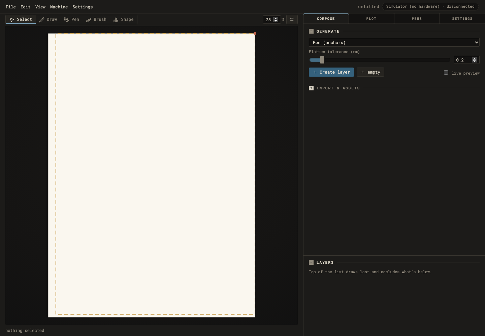
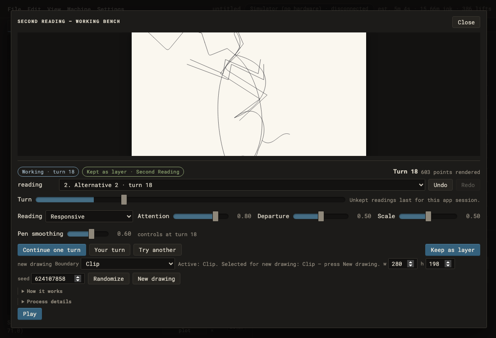
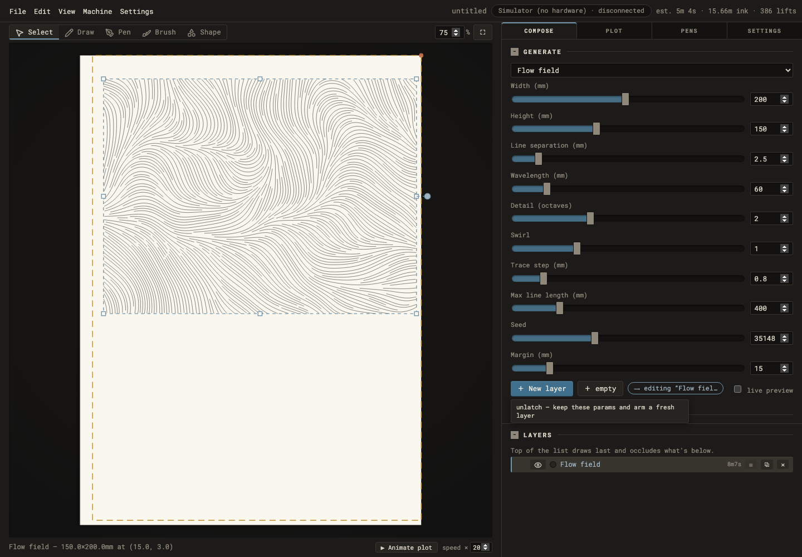
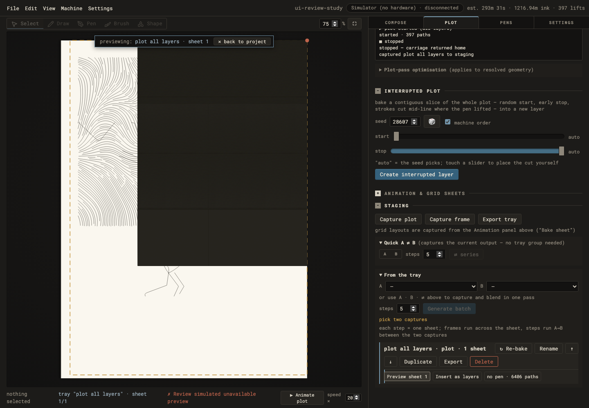
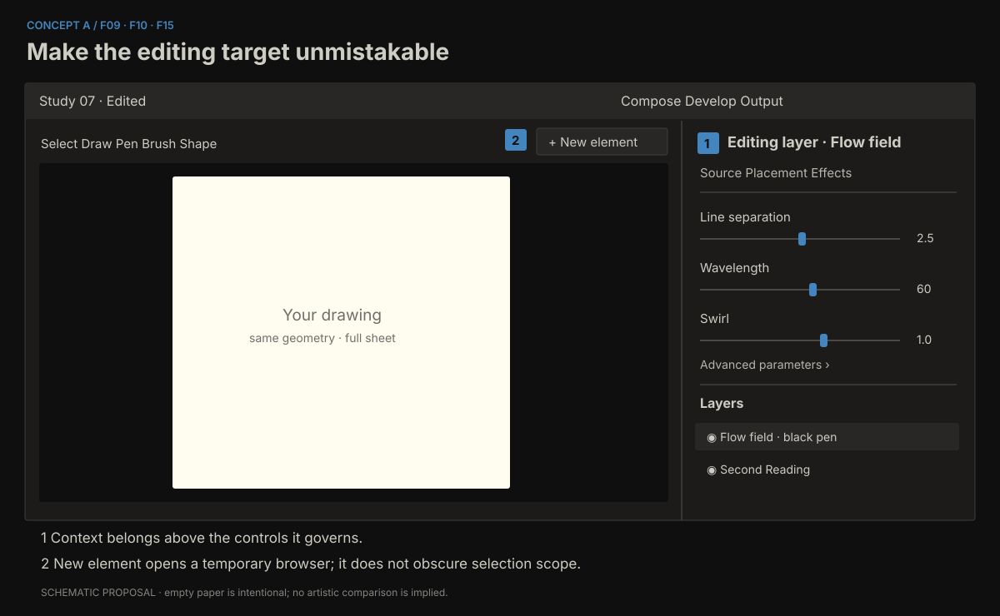
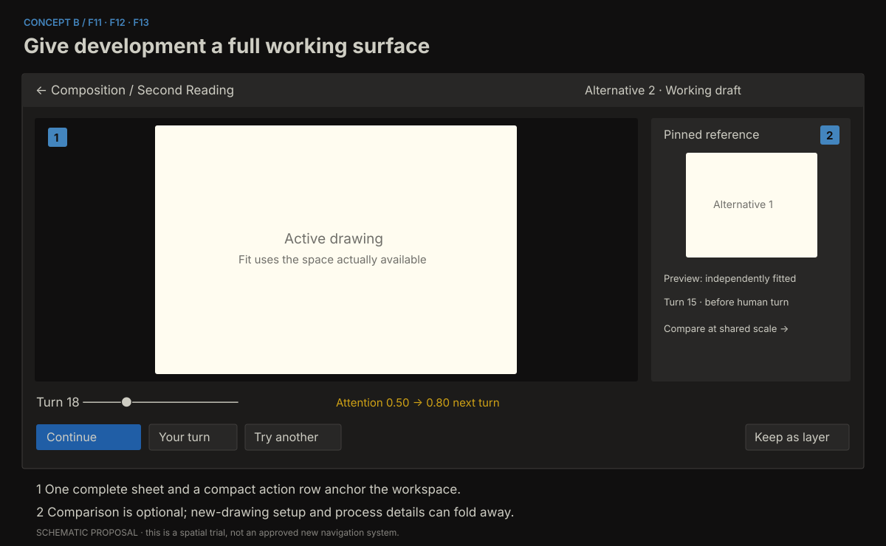
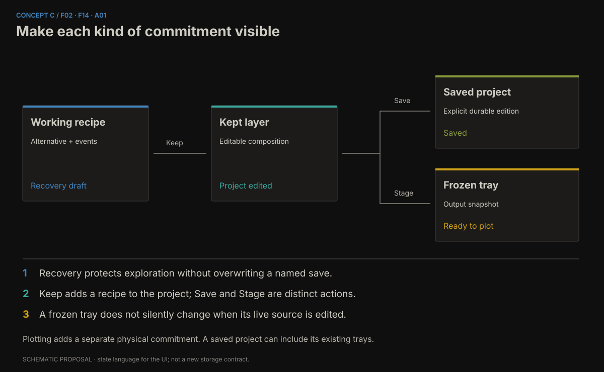

# AxiBridge: a more capable experimental instrument

**Holistic UI and interaction review · 7 September 2026** 
**Status:** evidence-backed proposals for discussion; no application changes. 
**Baseline:** `aa309b4` — Second Reading recovery, pen and boundary controls. 
**Audience assumption:** Ian’s personal experimental practice. The planning question received no separate answer; this follows the recommended default approved with the review run.

## 1. The central judgement

AxiBridge already has an identity worth developing. Its warm sheet, dark housing, restrained colour and monospaced controls describe a drawing instrument with unusual conviction. Its strongest interaction ideas are also specific: effects in physical units, a common geometry authority for preview and plotting, process scrubbing, alternatives that retain prior commitments, and a human turn that becomes part of a reproducible recipe. These are a stronger foundation for a contemporary tool than a fashionable replacement skin.

The gap is that the interface has grown through useful local additions faster than its overall organization has developed. “Generate” can mean prepare a new object or edit an existing one. “Plot” includes connection setup, fabrication, animation, experimental interruption, and a store of captures. Second Reading is a substantial creative workspace inside a modal whose layout can hide part of its drawing. The interface presents many accurate details, but the user must assemble their relationships mentally.

**The recommended direction is a coherent bench with explicit editing scope, protected working material and a much stronger visual comparison practice.** Keep the physical and experimental character. Make the interface more exact about what a gesture changes, when it changes it, where that change lives, and how it can be recovered. Then invest in side-by-side alternatives, continuation history and carefully chosen direct manipulation.

The most consequential findings are these:

1. **F01 — A smaller Second Reading window hides part of the sheet.** At 1100 × 750, the SVG measured 367.5 px high inside an overflow-hidden stage only 274.19 px high. This is display clipping, independently of the selected generative boundary.
2. **F02 — Recovery is weaker than the exploratory workflow needs.** Working alternatives survive closing the popup but disappear on page reload. Keeping a layer and saving a project are different commitments, with insufficient persistent communication of that distinction.
3. **F03 — Project-level undo is inconsistent.** A paper-guide change adds no undo entry. A reproduced sequence showed Undo removing the preceding layer instead of treating the guide edit as the latest action.
4. **F04 — Modal errors can be reported behind the modal.** A deliberately failed preview disabled Keep correctly, but the useful error appeared in the dimmed global status strip rather than beside the failed operation.
5. **F05 — Keyboard focus escapes the working bench.** Tabbing after its last control reached the page body and then the obscured File menu. This is a foundation problem, not a request for a different aesthetic.
6. **F09–F12 — Everyday creative work needs a clearer grammar.** Creation, selected-layer editing, temporal development, variants and staging should have recognizable relationships and stable homes.

There is no evidence here that replacing the frontend framework would, by itself, deliver these improvements. Some architectural work is justified; its purpose should be continuity, correctness and expressive room. The report distinguishes that work from visual changes and from proposals that need bench trials.

## 2. Scope, evidence and limitations

The review used the current source and project history, an existing Graphify map for orientation, an isolated built frontend, a temporary server with its own configuration and project directories, and Chromium driven through Playwright. Automatic hardware connection was disabled. Simulator connection and plot controls were exercised only against this isolated server. Ian’s running application and saved projects were not used.

The primary reviewer owned live inspection, design interpretation and synthesis. Terra supplied a bounded architecture review and a hardware-free guide/undo reproduction. Sol supplied a written interaction/accessibility review and screenshot-based cautions. Those reports were treated as evidence, not votes. Their findings have been consolidated here; source-only risks have not been promoted to reproduced failures.

### 2.1 Evidence vocabulary

1. **Observed:** a visible behaviour or measurement reproduced during this review.
2. **Source-confirmed:** the relevant implementation is present, but the full resulting user experience was not independently exercised.
3. **Hypothesis:** a plausible failure or improvement requiring a targeted trial.
4. **Proposal:** a design judgement, not a claim about current implementation.

A severity expresses consequence: **critical** concerns loss of work or misleading authority; **high** substantially obstructs making or operating; **medium** creates recurring friction; **exploratory** describes an opportunity. Effort estimates are relative: **S** is local, **M** crosses several cooperating components, **L** changes persistent state or workspace organization. These are scoping aids, not delivery promises.

### 2.2 What was exercised

| ID | Journey | Evidence and coverage |
|---|---|---|
| J01 | Empty project → generate → select | Created a flow-field layer; inspected generation latch, selected-layer controls and economics. |
| J02 | Process bench | Opened Homeostat, played and paused its process; inspected parameter and telemetry layout. |
| J03 | Alternating drawing | Advanced Second Reading, created another alternative, captured a pointer stroke, queued a control change, continued, and kept a layer. |
| J04 | Close, reopen, reload | Verified in-run alternatives survived popup closure; page reload returned to one fresh working alternative while kept project layers survived. |
| J05 | Save and open | Used Save As, New, and Load against temporary projects; previously saved layers returned. |
| J06 | Import and density | Imported synthetic SVG stripes through the visible file-upload UI. The final view contained 12,410 SVG path elements across four layers. |
| J07 | Plot operation | Connected the simulator, started, paused, resumed and stopped a job; inspected always-visible machine status. |
| J08 | Staged output | Captured a plot and previewed the tray sheet; verified the displayed plot-target sentence named that tray and its pass count. |
| J09 | Failure | Injected a 503 preview response through the test browser, observed the error and disabled Keep, then restored successful preview requests. |
| J10 | Adaptation and focus | Inspected 1440 × 1000, 1100 × 750 and 900 × 650 layouts; also a synthetic 200% CSS-zoom stress case and keyboard traversal out of a modal. |
| J11 | Undo boundary | Separate TestClient sequence demonstrated a guide mutation without an undo checkpoint. |

The 200% case used CSS zoom as a layout stress probe. It is not a substitute for native browser text zoom, operating-system scaling or a VoiceOver session. The density fixture is deliberately repetitive geometry; it tests delivery and layout, not artistic quality. Its measured import interval includes a settling wait and is not a latency benchmark.

### 2.3 Important remaining coverage

Native macOS shell behaviour, live VoiceOver output, physical pen swaps, registration, carriage motion, paper results, actual hand comfort, long-session fatigue and multi-monitor use remain unverified. Timeline/keyframe and multi-pen queue paths have source and existing acceptance-test coverage; this review did not independently exhaust their manual journeys. Image/video asset conversion and every generator/effect combination were not explored. Pens and settings were inspected, but a complete calibration session was intentionally excluded.

The tests and captures establish evidence for review. All proposals remain **ready for Ian to check**, not artistically accepted or proven comfortable in use.

## 3. What the experimental philosophy should protect

The recent project notes are especially important because they correct an easy review mistake. Mechanisms named fatigue, attention, crisis or relation do not establish what a drawing achieves. Neither smoothness nor discontinuity guarantees interest. Repetition, texture, scatter and prettiness are not forbidden. A UI review should not smuggle those rejected aesthetic restrictions back in as interface rules.

The older “canvas is the instrument, panels are its controls” framing remains productive. It implies that control organization must serve seeing and acting on the drawing. A region of the interface earns permanent space through its role in practice, not simply because a feature exists. It also makes cropping the visible sheet a first-order problem: the workspace must let the maker inspect the thing being judged.

### 3.1 Proposed principles

1. **Freedom of result, precision of operation.** A response can be surprising, indifferent or difficult to interpret. The scope of an edit, save or plot command should still be explicit. Uncertainty about the machine’s next artistic move can be useful; uncertainty about which layer was changed is avoidable cost.
2. **Reversibility supports risk-taking.** Trying an extreme value becomes more interesting when returning is easy. Preservation should cover working alternatives, not only finished output. Recovery is part of the instrument’s expressive capability.
3. **The sheet remains the visual authority.** Parameter values, labels and telemetry explain operations, but they do not grade the drawing. The visible work should retain enough scale and quiet around it to support judgement.
4. **Commitment has several meanings.** A captured stroke, next-turn intervention, kept layer, explicit save, staged sheet and physical plot have different consequences. The interface should help distinguish them without turning each into a ceremonial approval step.
5. **Expose causality selectively.** It is useful to see where a human stroke entered or a response mode changed. It is less useful to cover the drawing in internal variables at all times. Explanation should be available and accurately labelled, with the drawing as the default view.
6. **Preserve partial and awkward work.** A comparison system should accommodate inconclusive alternatives and local passages worth revisiting. It should not require each thumbnail to be a polished “result,” or rank work with a universal score.

### 3.2 What “cutting-edge” can mean here

The distinctive opportunity is continuity between improvisation and deliberate composition. Imagine interrupting a process, keeping two divergent continuations, comparing their implications at the same physical scale, drawing into one, placing it on the composition, and later reopening its exact recipe. That is a meaningful advance in capability and feel. It can be expressed with calm, modest controls.

The visual ambition is equally real: a consistent rhythm of controls, strong editing scope, confident line work, quiet but readable status, responsive layouts and animation that communicates change. A polished instrument can feel highly contemporary without becoming glossy. The current metaphor can become more precise and tactile through fit, alignment and response rather than ornamental depth.

Sources for the project philosophy: [drawing-machine session notes](../../../docs/IDEAS-drawing-machine-session-2026-09-05.md), [earlier UI ideas](../../../docs/IDEAS-ui-revamp.md), [settled August redesign](../../../docs/plans/ui-redesign.md), and the opening comment in [style.css](../../../axibridge/static/style.css). Historical suggestions in those documents are not descriptions of every current feature.

## 4. Strengths to retain deliberately

### P01 — Bench and bed

The only large light surface is the paper, and this creates immediate hierarchy. The surrounding housing recedes while still having a material character. The source specifies one typographic voice and a limited set of semantic accents. The empty-state capture is spare rather than promotional. Preserve this discipline when adding comparison, recovery or more descriptive controls.

### P02 — Geometry and physical consequence

Preview and plotting share server-side resolution, and effects operate in paper space. These are essential conceptual assets. Physical units make material decisions intelligible: a millimetre remains a millimetre even when the interface zoom changes. Layout changes must continue to distinguish view transforms from drawing transforms.

The main UI already displays estimated duration, ink distance and lifts. An old proposal to “add plot economics” has substantially been fulfilled. The next question is prominence, readability and explanatory context, not whether the numbers exist. The current estimator presents an uncertainty statement in Plot; physical accuracy was not tested here.

### P03 — A useful first version of creative continuity

Second Reading’s next-turn changes, event capture, alternatives and exact-recipe Keep guard are unusually relevant to this project. The live test confirmed an intervention was recorded as a stroke with its smoothing value and a later control change was queued for a named turn. Keep was unavailable when the visible recipe could not be trusted after a failed preview.

These are good semantics. The recommendation is to give them more room and clearer representation, not to replace them with generic sliders that rewrite the whole drawing on every movement.

### P04 — Persistent access to the layer list and machine state

The layer dock persists across inspector tabs, and machine status plus Pause/Resume/Stop live under the sheet. These avoid important navigation traps. A tray preview also produced a useful sentence stating which tray and sheet Plot would use. Preserve those cross-workspace facts even if the tab structure changes.

### P05 — A modular technical base

Module metadata already drives scalar parameter forms. Tool activation has a central broker. Generic process watching and specialized recorded interaction are separated. These afford incremental improvement: shared dialog behaviour, stronger control metadata and coordinated async presentation can be added without deciding every distant architecture question.

## 5. Trust, recovery and accessibility repairs

### F01 — Fit the complete drawing into the actual available stage

**Observed · High · S/M · Confidence: high.** At 1100 × 750, Second Reading’s stage was 274.19 px high while its SVG remained 367.5 px high. The stage hides overflow, concealing approximately 93 px, about a quarter of that SVG’s height. At 900 × 650, the SVG was 318.5 px high against a 260 px stage, while the modal also needed scrolling. At 1440 × 1000, the tested 280 × 198 recipe had a complete 490 px stage.

The cause is a layout conflict, not a generative boundary decision. `style.css:853` establishes a clipped stage; `:864–874` gives the SVG viewport-relative height; `:895–897` adds Second Reading’s modal/stage sizing. The drawing gets sized from the window while the stage gets the space left after controls. Both calculations can be individually reasonable and collectively wrong.

**Recommendation.** Make the stage’s available width and height the source of the fit calculation. Preserve aspect ratio within both bounds. Let secondary controls scroll in their own area, and keep a compact action row reachable. Introduce an explicit fit command and distinguish it from life-size viewing. Before creating a larger workspace redesign, this is a local repair worth isolating.

**Trade-off.** A complete sheet may appear smaller on a short window. That is an honest fit; provide deliberate zoom/pan for inspection rather than silently hiding part of it.

**Acceptance.** At the tested sizes, in both portrait-like and landscape-like frames, all four sheet edges remain inspectable at Fit. Expanding help and process details cannot silently crop the drawing. Pointer coordinates continue mapping to the same recipe frame. Overshoot mode still distinguishes the nominal sheet from the larger work frame.

### F02 — Protect working material and make durability explicit

**Observed + source-confirmed · Critical consequence · M/L · Confidence: high.** The draft map in `second_reading_bench.js:17–26` is browser memory. Our two alternatives survived Close/reopen, then reload returned to `Reading 1 · turn 12`; the kept layer remained in the project. Project Load directly replaces current state without a dirty-work guard (`settings.js:196–203`), whereas New has a warning. There is no persistent saved/edited indicator in the header.

This is not one missing Save button. There are two lifetimes: a working bench and the server-held project. A page reload does not mean the same thing as a server restart. “Unkept readings last for this app session” is an honest hint, but the phrase app session does not teach the browser/server distinction. “Kept” is accurate as promotion into a layer; it does not establish disk persistence.

**Recommendation.** First establish project revision and saved revision, plus a separate dirty state for working drafts. Show a quiet persistent `Edited`/`Saved` state beside the project name and `Working draft`/`Kept in project` in the bench. Make New, Load, Import and Restart use the same preservation policy. Then add an atomic recovery slot separate from explicitly named saves, with a scoped draft-recovery record for alternatives and pending settings.

Retain **Keep as layer**. It is a good studio verb. Pair it with “Project edited” until explicit save. For an unsaved working alternative, say “Working draft · not recovered after reload” until recovery is implemented. Afterward, say what actually persists rather than silently inheriting an optimistic label.

**Trade-off.** Recovery needs format/version rules, ownership and cleanup. It must not overwrite a deliberately saved edition. A local browser draft slot is smaller initially but does not travel with projects and is unavailable from a second device; project-owned draft records are more portable but enlarge the saved model. Choose the boundary explicitly.

**Acceptance.** Recovery restores a recipe, its event order, alternative links, staged next-turn controls and pending new-drawing choices. Recovery does not move hardware, alter the last named save or falsely mark material as plotted. Canceling a destructive switch leaves the complete working state available.

### F03 — Give every document edit a predictable undo unit

**Observed in isolated API reproduction · High · M · Confidence: high.** `PUT /project` directly assigns guide, name and plot options outside the ordinary session checkpoint path (`api.py:2012–2023`). In Terra’s test, create layer → guide x 0 to 17 → Undo removed the layer and incidentally reset the guide with the older snapshot. In a sequence with a later checkpoint, Undo left the guide at 17. The guide edit itself had no recoverable step.

The interface cannot explain Undo consistently when visually ordinary edits have different histories. Guide position can affect how the maker interprets and crops output; it deserves the same seriousness as layer movement. View-only changes need a deliberate policy, since some view changes also reorient qualifying layers.

**Recommendation.** Introduce one session-owned, validated project-update operation. Checkpoint actual document mutations under the session lock, with a single coalesced undo unit for a continuous drag. Keep presentation-only zoom outside document history. Name undoable operations where practical, such as `Undo move paper guide`, to make the boundary visible.

**Trade-off.** Checkpointing every intermediate input event would flood history. Reuse the existing coalescing discipline, and avoid creating entries for no-op changes. Do not assume every preference belongs in project undo.

**Acceptance.** Move a guide, change crop, move a layer and change an effect in sequence. Four undos reverse those actions in order. Redo restores them. Save/load preserves the intended result, and ordinary screen zoom does not consume the sequence.

### F04 — Report failure at the place of action

**Observed with injected failure · High · S/M · Confidence: high.** During a deliberately unavailable Second Reading preview, Keep correctly became disabled and the bench reported `not rendered`. The explanatory text, “Review simulated unavailable preview,” appeared in `#global-error` behind the dark modal. The same global error remained visible during a subsequent simulator workflow until its timer expired. This is a test failure injection, not evidence that the preview service failed spontaneously.

**Recommendation.** Add a small inline failure region to each asynchronous creative surface. State the failed operation, whether the previous picture remains visible, and offer **Retry this turn** without advancing or losing the recipe. Keep the last successful image with a clear stale label. Dismiss the failure on successful retry or explicit dismissal. Use the global strip for cross-workspace machine events, with local errors also recorded in a quiet history.

**Trade-off.** More status can crowd the bench. Show detailed text only on failure; reserve the normal row for a compact state. Do not keep a stale warning attached to an unrelated later operation.

**Acceptance.** Inject a failed preview and recover it without creating another turn. The user can identify whether the image is current, Keep cannot commit an unrendered recipe, and the error is reachable by keyboard and announced once by assistive technology.

### F05 — Give dialogs real boundaries and focus ownership

**Observed + source-confirmed · High · S/M · Confidence: high.** Tabbing beyond Second Reading’s Play control reached the page body and then File behind the overlay. Both popup structures are plain backdrops without dialog semantics (`index.html:332–374`, `:388–498`). Opening and closing do not establish a shared focus lifecycle. Escape closed the process popup in our test, which should be preserved.

**Recommendation.** Use one small modal controller: title association, meaningful initial focus, background inertness, forward/reverse focus containment and restoration to the invoking control. Match Escape to the active gesture: first cancel an armed or in-progress drawing gesture, then close the workspace only when appropriate. Explicitly decide whether the larger future bench should remain modal; do not use an ARIA label as a substitute for that product decision.

**Trade-off.** Dynamic forms make manual focus lists brittle. Use a shared lifecycle and native dialog behaviour where compatible, with real browser and shell testing. Keep hardware Stop accessible through the appropriate global/native route if a creative surface can remain open during plotting.

**Acceptance.** Bench, Watch and Render can be entered, traversed, canceled and exited using keyboard only. No background command receives focus while a modal owns interaction. Closing returns to its opener, and native shell behaviour is separately checked.

### F06 — Repair the keyboard and accessible-state foundation

**Source-confirmed, with partial live traversal · High · M · Confidence: high for missing structure.** Layer rows are draggable divs with click selection and double-click rename (`compose.js:1023–1104`); folds and resize handles depend on pointer handling; selected tabs and tools primarily communicate state through classes. Browser menu panels claim menu roles without a full menu keyboard model. These are manageable infrastructure gaps, but adding shortcuts alone will not resolve them.

**Recommendation.** Give the layer list a coherent keyboard model: focus a row, select/range-select, rename, reorder through commands, toggle visibility, and act on selection. Make folds real buttons with expanded state. Give tabs and tools accessible selected/pressed state. Choose either complete browser-menu behaviour or simpler disclosure semantics that match the implementation. Provide keyboard alternatives to resizing.

Keep freehand pointer drawing as a specific input modality. A screen-reader description of sheet size, layer selection, armed capture and current turn is useful; narrating thousands of paths would not substitute for viewing a drawing. Import and numeric shape controls provide practical alternative entry points without pretending they are identical experiences.

**Trade-off.** Full keyboard parity for every geometric gesture is a large project. Prioritize navigation, scope, cancellation, selection and consequential commands. Make the remaining modality limits explicit and avoid trapping someone inside a pointer-only state.

**Acceptance.** Complete a layer edit, a process turn, a save and an export without touching the pointer. Inspect names and selected states with an accessibility tree, then conduct a real VoiceOver pass. Do not claim accessibility compliance from DOM inspection alone.

### F07 — Make help stable across input modes

**Source-confirmed · Medium/High · S · Confidence: high.** The tooltip broker moves `title` into `data-tip` on first hover and removes `title` (`main.js:803–823`). It responds to pointer events, not focus. Icon-only controls can lose a fallback accessible name, and tooltip help becomes unavailable through the very keyboard path it should support. The copied text can also become stale when a dynamic control later changes meaning.

**Recommendation.** Assign stable accessible names independently of tooltips. Show concise help on focus as well as hover, with a shared description relationship. Use the visible control label for the action; use the tooltip for the extra consequence or shortcut. For longer conceptual material, offer persistent contextual help that can be read without holding the pointer still.

**Trade-off.** Native and custom tooltips can duplicate one another. Solve this in one control helper, with naming independent from visual tooltip suppression. Do not replace all useful explanations with terse labels in the name of cleanliness.

**Acceptance.** Hover, focus and change the state of visibility, duplicate, delete and shape controls. Their names stay correct. Keyboard users receive the same consequence and shortcut information.

### F08 — Improve legibility and target comfort without losing density

**Measured + source-confirmed · Medium/High · S/M · Confidence: high for dimensions; comfort provisional.** Layer action controls measured roughly 17–18 px high, with some widths near 21–23 px. Main body size is 13 px; engraved headings default to 10 px; consequential hints often use 11–11.5 px. At 1100 px wide, the default inspector still occupied 540 px, leaving a 528 px canvas well. At 900 px the interface changed to a stacked layout, substantially shortening the drawing area.

Small targets are a motor-comfort concern. A size below 24 CSS px is not automatically a WCAG failure: spacing and other exceptions must be assessed. Use [WCAG’s target-size guidance](https://www.w3.org/WAI/WCAG22/Understanding/target-size-minimum.html) as the precise reference, not a blanket mobile-sized-control rule. For small text, assess actual contrast pairs using [WCAG contrast guidance](https://www.w3.org/WAI/WCAG22/Understanding/contrast-minimum).

The current rust token `#c0644c` measures approximately 4.24:1 against the bench and 3.81:1 against the raised surface. This is insufficient for ordinary small text at 4.5:1. Preserve rust as an edge or icon accent while giving critical wording a stronger neutral text colour, or select a verified brighter accent. Disabled controls require separate assessment and should not be included indiscriminately in failure counts.

**Recommendation.** First solve layout allocation, then increase the hit areas and the most consequential labels. Retain mono as the default voice. Use a small set of type, line-height, target and spacing tokens; consider Compact/Comfortable only if two complete density treatments remain coherent. Add increased-contrast support. Avoid enlarging every label while leaving fixed panel widths unchanged.

**Trade-off.** Larger controls can reduce the visible parameter population. Group advanced fields and reclaim redundant status before spending more drawing space. Comfort must be judged on the actual bench display, with Ian’s viewing distance and input device.

**Acceptance.** All important state and actions remain reachable at small windows and enlarged text. Dangerous labels and focus indicators meet their relevant contrast requirements. An extended parameter-tuning session does not require precision clicks on tiny symbols.

## 6. Everyday work: from accumulated controls to a coherent bench

### F09 — Separate creating an element from inspecting a selection

**Observed + source-confirmed · High · M · Confidence: high for current behaviour; proposal needs trial.** After creating a Flow field, the Generate panel retained its controls, its primary button became `New layer`, and a small latch chip identified the layer being edited. The actual Layer section was below generation and import controls. On a 1000 px-high window, much of the selected-layer inspector lay below the visible region. A useful mechanism exists, but its scope is communicated late and in a small chip.

The latch saves repeated setup and makes generation fluid. Removing it would discard a genuine efficiency. The problem is that a panel headed Generate has changed from preparing a new object to changing an existing one while retaining almost the same spatial structure. The surface should make that transition as apparent as the selected layer on the canvas.

**Recommendation.** Give the upper inspector a persistent scope header: `New element · Flow field` or `Editing layer · Flow field`. Within selection mode, place Source, Placement and Effects in one ordered inspector with the layer’s name and pen. Keep a clear **New element** entry that opens a creation surface using the last parameters. If the current Generate panel remains, elevate its latch state into the heading and make “release this edit target” an explicit secondary action.

**Trade-off.** A context-sensitive inspector can move controls unexpectedly when selection changes. Preserve panel scroll and disclosure state by object and section; distinguish explicit selection from incidental hover. Do not reset a long form to its top after every parameter update.

**Acceptance.** Create two different generators, select the first, change its seed, then prepare a third without changing either existing layer. Ian should be able to predict the target before moving a slider, without reading a tooltip. A changed context should never silently retain the previous edit target.

### F10 — Give creation a searchable, visual entry point

**Observed inventory · Medium / exploratory · M · Confidence: high for inventory, medium for value.** The generator picker exposed 34 choices in two broad groups. It included direct-input constructions, procedural generators, image-driven operations and processes. Many carry rich conceptual names, but discovering them requires opening a text select and interpreting a label. The empty project starts with Pen anchors and a flatten-tolerance parameter, which communicates implementation before a creative invitation.

**Recommendation.** Add a compact browser for making a new element: searchable names, a one-line behaviour description, a few personally useful favourites, and small neutral previews where reliable. Use capability cues such as **draw**, **image required**, **process**, or **interactive bench**. Keep keyboard selection fast and let the existing dropdown remain as an expert compact view if it earns its space.

A preview should represent a family of possibilities, not a promise of an ideal result. Use two or three varied examples for a generator where one thumbnail would be misleading; retain difficult cases in the documentation. Search should match both the displayed name and practical terms like hatch, contour, text, growth or drawn stroke.

**Trade-off.** A gallery can become a distracting catalogue and make every choice feel like shopping. Keep it temporary, compact and personal. Avoid decorative promotional cards or endless example carousels. Generated thumbnails need cache and version rules.

**Acceptance.** Find a known generator through the keyboard in a few actions, discover an unfamiliar capability without reading source, and enter its appropriate workspace. The browser closes cleanly into the selected task, with the drawing again dominant.

### F11 — Give temporal development enough space to be the main activity

**Observed + proposal · High opportunity · M/L · Confidence: medium.** The Homeostat bench has a parameter column beside a stage and a transport below. Second Reading replaces that arrangement with several full-width rows underneath the stage. It now supports sustained authorship, alternatives, capture and preservation, yet still inherits popup furniture. The modal dims the entire composition while presenting a second sheet.

**Recommendation.** Prototype a **Develop** workspace that occupies the central working area, with an explicit return to the composition and a visible link to the originating layer or draft. This is a spatial proposal, not a demand to merge all code into one editor. Keep generic process watching lightweight; a brief Watch interaction can remain a popup. Let the sustained interactive bench graduate into a full working surface.

Arrange the principal actions near the stage: Continue, Your turn, Try another and Keep. Put new-drawing setup in a clearly separate area that can fold away after creation. Keep the effect of next-turn changes visible. The workspace header should identify the active alternative and whether it is a fresh draft or a continuation from a layer.

**Trade-off.** Another workspace can introduce navigation overhead and mode blindness. Use a stable sheet area, explicit scope title and predictable return. A maximized bench mode is a lower-cost intermediate experiment if a new workspace proves unnecessary.

**Acceptance.** Spend twenty minutes alternating human and machine turns without repeatedly managing the popup or losing the composition context. Compare a short Watch visit with sustained Develop use. If the full workspace adds navigation without improving seeing, capture or comparison, retain the modal with the layout repaired.

### F12 — Turn alternatives into something that can be seen and compared

**Observed limitation + proposal · Exploratory · M/L · Confidence: medium.** Working alternatives are presented as a text select. It records enough names and turns to switch, but their visual differences have to be held in memory. For an instrument whose artistic decisions concern relationships, that is a severe burden. A number or turn label is not a substitute for seeing the two offers together.

**Recommendation.** Begin with an optional two-up comparison of the current alternative and one pinned reference, synchronized by physical scale or explicitly labelled independent fit. Add a small shelf of saved views only after that proves useful. Show human interventions and branch points as sparse markers that can reveal provenance on demand. Let an alternative carry a short personal note such as “keep this knot” without requiring a rating.

Keep the comparison frame honest. If each drawing is independently enlarged to fill its thumbnail, a small concentrated result can appear equal in scale to a large sparse one. Label fitted thumbnails and offer shared framing for actual judgement. Allow comparing the same turn, the latest turn, or a deliberately chosen pair; do not force a synchronized timeline onto unequal developments.

**Trade-off.** Comparison divides visual area and may encourage searching many seeds instead of developing one drawing. Make pinning and returning cheap, while keeping single-sheet development the default. Do not add ranking, automatic “best” selection or similarity metrics that impersonate taste.

**Acceptance.** Compare two alternatives, return to one, and identify exactly which intervention produced the divergence. Weak and ambiguous alternatives remain available. Keep can promote either exact recipe without changing its sibling.

### F13 — Clarify temporal language and show actual versus queued changes

**Observed + source-confirmed · Medium/High · S/M · Confidence: high.** Second Reading uses `reading` for the alternative selector and `Reading` for the response policy. A staged control displays its proposed number, while one shared sentence says a control change is queued for the next turn. Boundary communicates active and pending choices more explicitly. The latter is useful semantics expressed with too much repetitive text when nothing differs.

**Recommendation.** Keep the name **Second Reading** and the action **Keep as layer**. Label the alternative selector **Alternative** and the policy selector **Response mode**. For changed controls only, show a small actual-to-next value such as `0.50 → 0.80 · turn 18`. Provide a visible way to discard queued changes. When Boundary is unchanged, show `Boundary: Clip`; expand to `Active: Clip · New drawing: Overshoot + fit` only when there is a difference.

Keep terminology precise across distinct time systems: **Turn** for recorded interaction, **Step** for a generator’s process axis when appropriate, **Frame** for timeline sampling, and **Animate plot** for pen-path replay. Do not unify these under a single unlabeled Play icon. Context should explain which kind of time is being manipulated.

**Trade-off.** Dual values can create numerical clutter and direct too much attention toward optimization. Show the difference only while a pending change exists. Preserve the optional details view for the full event record.

**Acceptance.** After changing several controls and scrubbing backward, the user can identify what produced the visible drawing and what the next action will change. Switching alternatives cannot silently carry queued changes to the wrong history.

### F14 — Reorganize output preparation around intent

**Observed + source-confirmed · Medium/High · M · Confidence: medium.** The Plot tab starts with four backend descriptions, then a plot target and controls, followed by interrupted-plot generation, animation/grid sheets and staging. This is understandable as a feature history, but it mixes choosing a machine with deciding how to develop and collect drawings. Repeated setup occupies premium space while current output state can be lower down.

**Recommendation.** Give **Output** a compact active-machine summary with Change/Connect as needed, then the exact visible target, pen passes, material choices and estimated costs. Put connection architecture and calibration in Settings or a machine detail surface. Place interrupted-plot creation with the other experimental transformations, while retaining a shortcut from output when useful. Give captures and tray sheets a recognizable collection surface or foldable shelf shared with composition.

Retain the existing target contract. Our tray capture displayed `Plot will plot: tray “plot all layers” · sheet 1/1 · 1 pass`. That specificity is valuable. Any new organization must still let the person know whether the sheet is live or frozen, which pen pass is next, and what changing the composition will or will not update.

**Trade-off.** Moving controls breaks learned locations. Keep transitional menu commands and avoid renaming every operation at once. The machine summary must still make disconnected and unsupported capabilities visible; a compact layout must not imply that all backends behave identically.

**Acceptance.** From a composed sheet, inspect target, choose the pen, estimate and start a simulator job with no ambiguity. From any creative workspace, pause/stop remains reachable. A frozen tray never silently becomes the live project.

### F15 — Improve the layer dock as a composition instrument

**Observed + source-confirmed · Medium/High · M · Confidence: medium.** The persistent dock is already a major asset. Its rows combine eye, pen swatch, name, estimate, occlusion state, duplicate and delete in a compact strip. The helper explains top-to-bottom drawing order, but relationships such as region, occluder and receiver require the inspector and textual interpretation. The selected-row action targets are particularly small.

**Recommendation.** Preserve the dock and its order. Add stable row focus, readable type badges for region/tween/source when relevant, and explicit controls for solo and reversible effect bypass if current workflows justify them. Separate row selection from the most destructive action by space or an action menu. Consider a temporary relationship overlay: selecting a region can highlight the layers it affects without changing their visibility.

A thumbnail is useful only if it can be generated cheaply and accurately at that layer’s role. A mask thumbnail that looks like visible ink could mislead. Prefer a simple role mark before adding expensive miniatures to every row. Keep real pen colour distinct from role/selection accents.

**Trade-off.** Rich rows grow taller and reduce the visible population. Offer detail on selection or hover/focus, and preserve a compact list. Layer groups and a new nesting model are separate structural decisions; this review does not authorize them as a cosmetic follow-on.

**Acceptance.** With a mixed stack, identify the selected object, what it affects, what obscures it and which pen will draw it. Reorder without pointer drag, temporarily isolate a layer, then restore the previous view without corrupting visibility or undo history.

### F16 — Treat parameter design as part of the module, not only its validation

**Observed + source-confirmed · Medium opportunity · M · Confidence: medium.** The auto-form is a powerful extension seam, but equally sized sliders give width, seed, numerical trace precision and conceptual behaviour similar visual weight. Generic fields often disclose their implementation order rather than the maker’s decision order. Descriptions are largely tooltips, which is insufficient for new experimental controls.

**Recommendation.** Extend the supported parameter metadata conservatively: primary versus advanced group, physical unit, useful step and fine step, linear versus log scale where justified, neutral/default marker, reset affordance and concise visible consequence. A seed benefits from an exact numeric value and reroll/lock actions rather than an enormous continuous range. A technical tolerance belongs in advanced controls unless it is the current creative subject.

For a process, make it explicit whether a change regenerates the entire trajectory, affects only the next turn or establishes a new drawing. The schema can declare this interaction contract, but the domain implementation must actually support it. Do not infer temporal semantics from a label alone.

**Trade-off.** An elaborate metadata language can become a second UI framework. Add one or two fields against real modules and validate their usefulness. Specialized controls remain appropriate when a generic slider would distort the operation.

**Acceptance.** Configure a familiar module quickly, understand one unfamiliar primary parameter, reset a changed value, and reach advanced precision controls without losing the current result. No unsupported nested object should masquerade as a valid scalar text field.

### F17 — Add direct manipulation where it makes a relationship visible

**Proposal grounded in current physical controls · Exploratory · M/L · Confidence: medium/low until tried.** Placement already has canvas handles and numeric values. Other parameters describe spatial relationships that may benefit from on-sheet affordances: a source position, region reach, margin, orientation or a direction field. The opportunity is to make intent tangible rather than to put every parameter on the drawing.

**Recommendation.** Prototype one high-value spatial control for one well-understood module. Keep its physical value readable, allow fine adjustment and cancellation, and hide the handle when the maker is judging the result. Use a clear preview versus committed-state convention. Offer the same operation numerically so a gesture is not the only route.

**Trade-off.** Handles can obscure the marks under judgement, imply causality the generator does not possess, and introduce coordinate errors in rotated views. The control should represent a real parameter with an exact inverse mapping, not an attractive metaphor over unrelated computation.

**Acceptance.** Moving the handle and entering the equivalent number yield identical resolved output in portrait and landscape. Cancel restores the prior state; one continuous gesture yields one undo unit. Ian prefers it to the original control for that actual task.

### F18 — Make feedback precise, quiet and durable

**Observed + source-confirmed · Medium · S/M · Confidence: high.** The global error clears after eight seconds (`main.js:115–125`). Delete and restart confirmation states expire after 2.5 seconds. Save temporarily replaces the menu item’s entire text, removing the child shortcut label (`main.js:483–493`). A successful command can be difficult to distinguish from a changed mode or a persistent saved state.

**Recommendation.** Use persistent state for things that remain true, transient acknowledgment for completed low-stakes actions, and explicit resolution for failures. Save should update the document state while leaving the command and shortcut intact. Undoable deletion can be immediate with a clear undo affordance; irreversible replacement needs a stable decision, not a countdown. Announce coarse machine and process phases, not every position or rendered frame.

**Trade-off.** Permanent notifications can accumulate. Limit status to the currently relevant fact, with a small history for details. A fresh success should clear the failure it actually resolves, not all unrelated warnings.

**Acceptance.** Save twice and retain the shortcut label. Wait ten seconds while deciding a destructive action and still be able to complete or cancel it. A screen-reader user receives meaningful connection, hold, completion and error events without coordinate chatter.

## 7. Visual direction: evolve bench and bed

The desired visual lift is systematic. Keep the recognizable warmth and mono rhythm, then reduce competition among labels, controls and status. The current surface is strong enough that inconsistent details are more noticeable: a dice emoji among otherwise restrained tools, closely packed small action glyphs, long technical explanations competing with ordinary instructions, and several primary blue buttons in one temporal workspace.

### 7.1 Surface and palette

Use the project-wide Flexoki standard for the proposed direction and this report. The current app’s bench-and-bed tokens are custom warm colours, not the exact Flexoki scale. Migrating them is a proposal, not a correction already made. Preserve the distinction between paper and housing, and distinguish actual pen colours from interface semantics.

Flexoki’s published dark roles map background to black, raised background to base-950, interface states to base-900/850/800, primary text to base-200 and secondary text to base-500; its main dark accents use the 400 scale. The raw values used for this report are in [the vendored CSS](assets/flexoki.css), with [the upstream mapping](https://stephango.com/flexoki) and MIT license retained. Faint text is not automatically suitable for consequential instructions. Verify every foreground/background combination after mapping.

A literal palette swap is insufficient. Preserve the strong separation between paper and bench, assign status meanings once, and keep active selection distinguishable from “can be clicked.” For example, a quiet button edge can identify availability while a filled control marks the next primary action. Pending values need a separate cue from selected controls, with text as well as colour.

### 7.2 Typography and hierarchy

Retain Roboto Mono in the application, consistent with Ian’s earlier decision. Propose three practical roles: section identity, working label and exact readout. Use weight, spacing and grouping before shrinking secondary text. Keep uppercase engraved labels for stable sections; use normal case for instructions and meaningful state.

This report uses system fonts for long reading, because its task differs from the instrument. That is not a proposal to replace the application’s mono voice. [Apple’s typography guidance](https://developer.apple.com/design/human-interface-guidelines/typography) supports legibility, a restrained number of typefaces and a consistent hierarchy; it does not establish a single correct aesthetic for AxiBridge.

### 7.3 Controls and interaction feel

Use a shared rhythm for label, value, track, reset and help. Fine adjustment should have the same meaning wherever it exists. Increase the invisible hit region where a small visible glyph is appropriate, but do not allow overlapping targets. Align numeric values and units so a form can be scanned vertically. Avoid using disabled-looking low contrast for an enabled ordinary action.

Motion should clarify change: a brief indication that an alternative has been added, a pending value becoming committed, or a selection moving to another scope. Do not crossfade different drawings by default; a blend can conceal a meaningful difference and briefly show a third drawing that was never generated. Use immediate replacement or an explicit comparison mode for exact visual judgement. Preserve reduced-motion support.

### 7.4 Proposed structural sketches

The following sketches are deliberately schematic. They show scope, relative allocation and action placement; they are not implementation-ready layouts or new drawings. Empty paper placeholders avoid biasing a layout judgement with a more appealing artistic sample.

**Concept A — composed evolution.** Keep the horizontal tools, sheet and right-side inspector. Move creation into a temporary browser and make the inspector identify its selected layer. The dock persists. A compact machine summary and document state stay visible. This is the lowest-disruption direction and the recommended first prototype.

**Concept B — development as a workspace.** Give an interactive process the main working area. Keep the composition one explicit return away. Move new-drawing setup out of the active turn controls. Alternatives are optional and visual, with two-up comparison available when requested. This is the strongest candidate for an experiential leap, after F01–F08 are addressed.

**Concept C — visible lifetimes.** The important architecture can be communicated with a few precise states. Working material can be recovered; Keep creates a layer; Save records the project; staging freezes output. Editing a source does not silently alter a frozen tray. These relationships should be visible in language and small affordances, not as a compulsory diagram in the product.

## 8. Architectural work justified by the experience

Architecture findings here are proposals for investigation and implementation sequencing. They are not permission to rewrite the application. Their value is measured by what they make possible or reliable for the maker.

### A01 — One mutation boundary and explicit revisions

**Source-confirmed; guide/undo subset reproduced · M/L.** The direct project update and the stronger layer-session mutation path coexist. Route document changes through one session-owned transaction boundary, increment a project revision after successful mutation, and retain a saved revision. This supports correct undo, dirty state, recovery and response provenance at once.

Keep global machine settings and browser display preferences distinct from document mutations. Do not turn carriage state into an undoable project property. A saved revision should describe durable document content, not imply that the drawing has physically been plotted.

An alternative is frontend-only dirty tracking. It is cheaper initially, but API calls, another browser and server-side operations can bypass it. Given the existing API-first model, a server-owned revision is the more defensible boundary. Start with known document mutators and define no-op/coalescing behaviour before exposing the state in the header.

### A02 — Coordinate asynchronous presentation by user intent

**Source-confirmed gap; races not reproduced · M.** `main.js:247–268` always assigns the arriving resolved response. `showDocPreview` at `:282–290` likewise accepts a sheet response without a shared presentation-generation guard. Exiting a preview does not invalidate an older pending preview request. Local generator and Second Reading previews already have serial/single-flight guards.

A plausible consequence is an older response painting after a newer edit or after leaving a tray. This remains a risk to test, not a demonstrated screen failure. A request coordinator should associate each presentation with its intent, project revision and view kind. Only the current intent may install geometry and target labels. Canceling work is optional; rejecting stale presentation is necessary.

Do not collapse every request into one queue. A destructive mutation must complete reliably; a superseded preview can be ignored; plot progress remains a stream. Extract the smallest shared guard and preserve the distinct semantics of each operation.

**Acceptance probe:** delay an older resolved or tray response, change the live state, then release it last. Geometry, view label and Plot targeting must remain on the newest intended state. If the current behaviour already survives a particular sequence, retain that evidence and refine the scope rather than claiming the entire system is broken.

### A03 — Return an internally consistent resolved snapshot

**Source-confirmed boundary gap; concurrency failure untested · M.** `Session.resolved()` protects resolution, but the API subsequently reads live project metadata and region display paths while assembling its response (`api.py:1104–1168`). These synchronous endpoints can run in worker threads, so simultaneous mutation is plausible. The risk is a response assembled from different logical revisions, not a claim that every resolve does so.

Build the complete immutable display snapshot at the session boundary, including the region silhouettes needed by the client, and tag it with the document revision. Serialize afterward. This strengthens the existing geometry authority. It must not create a parallel client geometry pipeline.

The cost is holding or copying a coherent snapshot, plus careful treatment of large geometry references. The existing purity and replacement rules make shared immutable geometry practical. Test deletion, project replacement and region changes during a delayed resolve, then measure the overhead before broadening the design.

### A04 — Measure the whole preview pipeline before changing the renderer

**Observed dense fixture + source-confirmed scaling · M, potentially L.** The final synthetic import produced 12,410 SVG path elements across four layers. The import-to-count interval was 1.673 seconds including a deliberate 600 ms settling wait. It demonstrates a dense DOM and successful completion of that case; it does not establish drag latency, paint latency or a frame-rate ceiling.

The current renderer recreates path elements during canvas rendering (`canvas.js:273–380`). Server cache performance does not account for transport, JSON parsing, string assembly, hit paths, DOM replacement and paint. Instrument those phases separately, with representative image-driven and region-heavy projects as well as synthetic geometry.

First try incremental updates and per-layer path batching where attributes agree. Preserve selection hit testing and the special requirements of draw-order visualization. Only consider raster or GPU display paths if measured costs justify them. A display simplification must be explicit, reversible and clearly separate from exact plot/export geometry; never quietly trade material accuracy for frame rate.

Proposed acceptance budgets should be agreed against the bench machine: immediate visible gesture feedback, bounded latest-preview latency, and no long interruption of selection or Stop. These are desired qualities, not measured current guarantees. A simpler renderer that meets them is preferable to a more ambitious one with new correctness risks.

### A05 — Add a small shared UI foundation, preserve domain-specific benches

**Source-confirmed · M.** Repeated dialog, tooltip, fold, async-state and control behaviour is a stronger abstraction target than all creative features at once. Introduce shared lifecycle helpers and a small set of semantic controls where they remove repeated failure modes. Generated forms should declare and validate their supported schema profile; unsupported arrays or nested structures should not silently fall through to a misleading text input.

Keep ordinary process watching separate from recorded intervention. The module guide already explains that declaring capabilities does not teach an arbitrary generator how to interpret a score. If another specialized process arrives, introduce a named bench adapter only when its contract is known. Do not infer that every process wants Second Reading’s exact interface.

A component library or framework could help later with stable rendering and accessibility, but it carries integration, packaging and source-fallback costs. The current source remains plain modules with a built output and a no-npm serving fallback. A migration must name which recurring problems it removes, preserve that deployment contract or explicitly reopen it, and prove one demanding workflow before expanding.

The node-editor question remains open. A graph view is justified when users need to inspect or manipulate relationships that the layer/region model cannot express clearly. It is not automatically justified by the word experimental or by the existence of multiple generators. A read-only dependency view is a smaller probe than changing the document model.

## 9. Contemporary references and what to borrow

These references were consulted through current primary documentation on 7 September 2026. The comparison is about specific design patterns, not a claim to have tested the latest desktop versions of these products. Each proposed application to AxiBridge is our inference.

### R01 — Ableton Live: experimentation and committed output can coexist

Ableton’s Session View organizes clips and scenes for nonlinear performance. Its manual explicitly describes the relationship with Arrangement and the control for returning to Arrangement playback. It also supports capturing a currently playing configuration into a scene. The relevant lesson is that an exploratory surface and a committed composition can coexist if their relationship and current authority remain visible. [Ableton Live 12: Session View](https://www.ableton.com/en/manual/session-view/).

**Borrow:** a clear distinction between developing material and the composition/output it feeds; quick capture without prematurely ending experimentation. **Adapt carefully:** AxiBridge has physical paper and exact recipes, so recording a state is not the same as continuously recording audio. **Do not inherit by default:** transport conventions that imply every creative process runs on one universal clock. This supports F11–F14.

### R02 — TouchDesigner: expose who or what controls a value

TouchDesigner documents distinct parameter modes, including Constant, Expression, Export and Bind. Binding establishes synchronized values between parameters. The relevant pattern is explicit value ownership: a number is not merely displayed, its means of control can be inspected. [Derivative: Parameter Mode](https://derivative.ca/solr/parameter-mode), [Binding](https://derivative.ca/UserGuide/Binding).

**Borrow:** concise cues for a value controlled by a generator, queued for the next turn, interpolated by the timeline or edited directly. **Adapt carefully:** these cues must reflect actual AxiBridge contracts. **Do not inherit by default:** a full node graph or expression interface for every scalar. This supports F09, F13 and F16.

### R03 — Bespoke Synth: preserve discoveries without requiring foresight

Bespoke’s reference documents a rolling audio capture, save/load state, and snapshots that store and restore groups of control values. These are different preservation tools for different moments of practice. [Bespoke Synth reference](https://www.bespokesynth.com/docs/).

**Borrow:** several explicit ways to preserve an interesting state, and a recovery mechanism that does not require predicting which moment will matter. **Adapt carefully:** AxiBridge needs recipe/event identity and physical-scale comparison; an image alone cannot resume a drawing. **Do not inherit by default:** modifier-heavy hidden commands as the only access path. This supports F02 and F12. No rolling recording feature is proposed merely because a music tool has one.

### R04 — HIG and WCAG: use principles precisely

Apple’s guidance on [layout](https://developer.apple.com/design/human-interface-guidelines/layout), [typography](https://developer.apple.com/design/human-interface-guidelines/typography), [colour](https://developer.apple.com/design/human-interface-guidelines/color) and [accessibility](https://developer.apple.com/design/human-interface-guidelines/accessibility) informed the inspection. The local skill references supplied readable versions where the current web pages required client rendering. WCAG’s [focus-not-obscured guidance](https://www.w3.org/WAI/WCAG22/Understanding/focus-not-obscured-minimum) is especially relevant to keyboard navigation beneath overlays.

Use these to ask whether information is perceivable, controls are operable and state is understandable. They do not prescribe a generic appearance, mandatory light mode, card layout or particular font. Accessibility repairs should strengthen the instrument’s actual vocabulary. Any formal compliance claim would need a separate, more complete evaluation.

## 10. Recommended sequence and decision gates

The order below protects the work first, then improves everyday fluency, then tests the largest experiential opportunities. It is a proposed implementation sequence, not an approved implementation plan. Each phase should end with a usable app and an owner check before wider rollout.

| Handle | Phase | Included findings | Exit evidence |
|---|---|---|---|
| M1 | Restore viewing and interaction confidence | F01, F03, F04, F05; stable accessible naming from F07 | Complete sheet at representative sizes; correct guide undo; local retry; contained focus and return. |
| M2 | Protect experimentation | F02, F18, A01; scoped recovery design | Explicit saved/edited state; guarded replacement; tested recovery without overwriting named saves. |
| M3 | Strengthen daily composition | F06–F10, F15–F16, A05 | Keyboard layer workflow; clear edit target; readable controls; creation discovery that stays fast. |
| M4 | Prototype sustained development | F11–F13 | Side-by-side owner trial of repaired modal versus Develop workspace; exact alternatives and shared-scale comparison. |
| M5 | Clarify output and larger workloads | F14, A02–A04 | Correct target under delayed responses; coherent snapshots; measured dense-scene interaction; practical output preparation. |
| M6 | Explore spatial authorship | F17 and any justified graph/adapter experiment | One bounded prototype demonstrates value in actual use before expanding the model. |

Some A02/A03 work may move earlier if targeted race tests reproduce misleading output. Likewise, recovery may precede other M1 repairs if a session is about to rely on long-lived working drafts. Prioritization should respond to evidence and expected use, not a rigid release calendar.

### 10.1 Recommendation index

| Handle | Change | Priority | Effort | Confidence / dependency |
|---|---|---|---|---|
| F01 | Stage-constrained sheet fit | High | S/M | Reproduced; preserves coordinate mapping. |
| F02 | Draft/project recovery and saved state | Critical consequence | M/L | Reproduced lifetime boundary; requires persistence decision. |
| F03 | Consistent project undo | High | M | API reproduction; session mutation boundary. |
| F04 | Local failure and retry | High | S/M | Injected failure reproduced; async lifecycle. |
| F05 | Modal focus and ownership | High | S/M | Focus escape reproduced; shared controller. |
| F06 | Keyboard and accessible states | High | M | Source-confirmed; real assistive-tech check needed. |
| F07 | Stable names and help | Medium/High | S | Source-confirmed tooltip mutation. |
| F08 | Legibility, hit areas and adaptation | Medium/High | S/M | Measured dimensions/contrast; owner comfort check. |
| F09 | Clear creation versus selection scope | High | M | Observed; preserve latch efficiency. |
| F10 | Searchable creation browser | Medium | M | Proposal; test speed against dropdown. |
| F11 | Sustained development workspace | Exploratory | M/L | Owner trial; follows stage repair. |
| F12 | Visual comparison and alternatives | Exploratory | M/L | Recipe identity, storage and frame policy. |
| F13 | Temporal language and queued values | Medium/High | S/M | Observed; preserve next-turn semantics. |
| F14 | Intent-led output preparation | Medium/High | M | Preserve live/tray/pass authority. |
| F15 | Layer dock relationships and commands | Medium/High | M | Keyboard model; avoid implicit grouping redesign. |
| F16 | Better parameter metadata and affordances | Medium | M | Supported schema profile; bounded examples. |
| F17 | One spatial-control prototype | Exploratory | M/L | Exact inverse mapping; view invariants. |
| F18 | Quiet, durable feedback | Medium | S/M | Source-confirmed; state lifecycle. |
| A01 | Transaction boundary and revisions | High enabling work | M/L | Undo, dirty tracking, recovery. |
| A02 | Latest-intent presentation guard | High risk to test | M | Race reproduction pending. |
| A03 | Coherent versioned snapshots | High risk to test | M | Concurrency reproduction pending. |
| A04 | Measure and optimize preview pipeline | Medium | M/L | Dense fixture exists; profiling still needed. |
| A05 | Shared UI foundation and bounded adapters | Medium | M | Start with repeated behaviours. |

### 10.2 What not to bundle into the first implementation

1. **A framework migration.** First prove which state, focus or rendering failures demand it. Do not make small trust repairs wait for a new stack.
2. **A new graph-based document model.** Keep this as a separately argued response to real relationship-editing needs.
3. **A complete generator aesthetic overhaul.** This report reviews the instrument. Drawings need their own review with whole populations, weak cases and human exchanges.
4. **A public-product onboarding programme.** The chosen assumption is personal practice. A creation browser and understandable scope are useful to Ian without introducing tours, accounts or promotional empty states.
5. **Universal scoring of alternatives.** Comparison should enlarge judgement, not supply a proxy for it.
6. **A blanket parameter reduction.** Advanced controls can be useful experimental material. Their location and meaning need improvement more often than their removal.

## 11. Questions worth taking to the bench

These are addressable design questions, not blockers on this completed review. The recommended starting answers are explicit so the next conversation can focus on disagreement.

1. **Q01 — What kind of continuity matters most?** Recovering exactly where you stopped, comparing divergent readings, or keeping a personal library of reusable fragments? Recommendation: recovery first, then two-up comparison. A library needs stronger evidence of repeated reuse.
2. **Q02 — Does development want the main sheet?** Would you rather enter a sustained workspace or keep the bench as a maximizable popup? Recommendation: compare both with the same twenty-minute human/machine session, after fixing fit.
3. **Q03 — How much comparison is enough?** Two pinned alternatives, a small contact sheet, or a richer branch history? Recommendation: two pinned alternatives with clear framing, then expand only if the select remains a bottleneck.
4. **Q04 — What should remain strange?** Which terms and gestures feel like the instrument’s own language? Recommendation: retain Keep, Your turn and Second Reading; clarify overloaded reading and hidden latch scope.
5. **Q05 — Which controls should be physically direct?** Is there a parameter you repeatedly understand by pointing at the drawing rather than by entering a number? Recommendation: choose that one for F17; do not add a universal overlay system first.
6. **Q06 — How much of the machine’s account is useful while judging?** Always-visible event markers, an optional history, or an inspect-on-demand explanation? Recommendation: optional sparse event markers and persistent recipe access, with raw telemetry folded away.
7. **Q07 — How tightly should experiments travel with projects?** Should saved projects include all working alternatives, or only explicitly attached drafts? Recommendation: automatic local recovery plus explicit project attachment initially, with clear limits when moving machines.
8. **Q08 — How much visual change feels like a lift?** Does a refined mono bench with stronger hierarchy meet the ambition, or do you want a more radical spatial departure? Recommendation: preserve the voice and test A/B workspace sketches before changing the aesthetic language.

A useful owner trial should allow disagreement with the review. For example, if the repaired popup supports sustained work perfectly well, that is evidence against a separate Develop workspace. If two-up comparison interrupts momentum, pinning a reference in place may be enough. The report is intended to make those judgements concrete.

## 12. Acceptance through actual practice

Use the same starting material when comparing old and proposed interfaces. Keep a small set of representative projects: a sparse procedural layer, a dense image-driven drawing, a mixed region/occlusion stack, a Second Reading recipe with human events, and a multi-pen staged sheet. The synthetic stripe fixture is useful for technical stress but should not replace these real materials.

### T01 — The ordinary composition session

Open a project, create another element, switch between two layers, alter a source parameter, add and reorder an effect, adjust physical placement, save under a new name, and reopen it. Record scope surprises, lost scroll position, unintended edits and recovery friction. Compare time only after the steps are understood; raw click count misses the cost of uncertainty.

### T02 — The experimental conversation

Develop one drawing for twenty minutes. Make at least three human turns, change response controls, revisit an earlier turn, branch and keep two alternatives. Leave one awkward alternative unkept. Close, reopen and recover the session. Record whether interface management interrupts attention to the drawing, and whether comparisons reveal something useful without encouraging endless seed browsing.

### T03 — The material transition

Choose a live frame, then a frozen tray sheet. Confirm what will plot, which pen is next and what remains editable. Exercise simulator hold/resume/stop first, then conduct a separate supervised physical trial. Judge screen ergonomics and material truth separately. A green simulator test cannot establish registration, ink behaviour or physical stop performance.

### T04 — The failure and access session

Delay a preview, fail one request, cancel an operation, lose a connection and attempt to replace unsaved work. Repeat navigation using keyboard and with VoiceOver. Inspect the short-window and enlarged-text treatments. Recovery and error messages should name the same underlying state across all routes. Include a deliberately slow reader in the timing of confirmations, even if the owner usually operates rapidly.

### T05 — The visual judgement session

Compare the old and proposed layouts with neutral names and the same drawing at the same scale. Ask where attention goes first, what controls appear available, and which state is uncertain. Do not tell a reviewer which design is newer or which mechanism it uses until the initial observations are recorded. No beauty scores are required. Keep useful disagreements, especially when a more orderly layout feels less inviting to work in.

## 13. Evidence record and verification

### 13.1 Baseline checks

The complete isolated baseline finished with **1,263 tests passed**, with one existing Starlette/httpx deprecation warning. Its acceptance fixture built the frontend. The review’s earlier incomplete-copy runs failed because the temporary copy initially omitted the launcher, then lacked the local `.venv` path expected by a launcher test. Those were corrected in the review harness; no application fix was made. The final complete run is the evidence for the passing baseline.

Several live scripts were exploratory and were adjusted when a locator assumed visible layer rows in a hidden/collapsed dock or assumed that an imported SVG used its filename as a layer name. These were harness assumptions, not product failures. Final recorded flows use the actual resulting state. Save/load and the dense fixture were rerun after the early overlap between two walkthrough scripts; no concurrency defect is claimed from that overlap.

Passing the baseline does not invalidate the defects in this report: the new cases are not all covered by the existing assertions. Conversely, source-level risks do not become defects merely because they would be useful tests. Application code was not modified during the review.

### 13.2 Local evidence files

1. [Second Reading evidence](assets/second-reading-evidence.json): complete stage rectangles, recorded human stroke, queued value, alternatives, Keep, closure/reload behaviour.
2. [Workflow evidence](assets/workflow-evidence.json): save/load, generic process playback, focus escape, injected preview failure, simulator operation and tray targeting.
3. [Measurements](assets/measurement-evidence.json): computed control geometry, type/colour values, layout rectangles, CSS-zoom probe and dense import count.
4. [Evidence catalogue](EVIDENCE.md): screenshot descriptions, baseline log and supporting source audits.
5. [Design sketches](assets/concept-compose.svg): schematic proposals; the linked report also includes development and lifetime diagrams.

### 13.3 Source map for follow-up

| Handle | Source starting points | Why it matters |
|---|---|---|
| S01 | [style.css](../../../axibridge/static/style.css), lines 1–141, 289, 834–939 | Visual system, default allocation, modal/stage sizing. |
| S02 | [index.html](../../../axibridge/static/index.html), lines 213–252, 332–498 | Shared machine state, preview dialogs, Second Reading controls. |
| S03 | [main.js](../../../axibridge/static/js/main.js), lines 115–125, 247–297, 483–524, 699–775, 803–834 | Errors, async presentation, save feedback, tool broker, tooltips. |
| S04 | [compose.js](../../../axibridge/static/js/compose.js), lines 175–330, 1023–1288 | Generate/latch behaviour, layer interaction and controls. |
| S05 | [second_reading_bench.js](../../../axibridge/static/js/second_reading_bench.js), lines 17–38, 304–432, 519–540, 670–714 | Draft lifetime, queued state, Keep identity and stage rendering. |
| S06 | [process.js](../../../axibridge/static/js/process.js), lines 1–25, 91–139, 182–206, 309–347 | Generic Watch/Bench scope and async lifecycle. |
| S07 | [settings.js](../../../axibridge/static/js/settings.js), lines 137–155, 189–214 | Restart, New, Load and Import preservation policies. |
| S08 | [api.py](../../../axibridge/api.py), lines 1104–1168, 2012–2023, 2051–2099 | Payload coherence, project mutation and save/load. |
| S09 | [session.py](../../../axibridge/session.py), lines 634–651, 806–830, 2888–2917 | View policy, mutation discipline and geometry authority. |
| S10 | [forms.js](../../../axibridge/static/js/forms.js), lines 64–96, 223–341; [module guide](../../../docs/MODULES.md) | Parameter dialect and future control semantics. |
| S11 | [canvas.js](../../../axibridge/static/js/canvas.js), lines 273–380 | Dense rendering and hit-path cost. |
| S12 | [acceptance suite](../../../tests/test_acceptance_ui.py) | Existing user-visible regression contracts. |

The linked source is authoritative for the inspected baseline. If implementation starts from a later revision, re-check these locations and the relevant behaviour before applying a recommendation. Historical roadmap prose contains superseded details; this review does not reactivate them as requirements.
